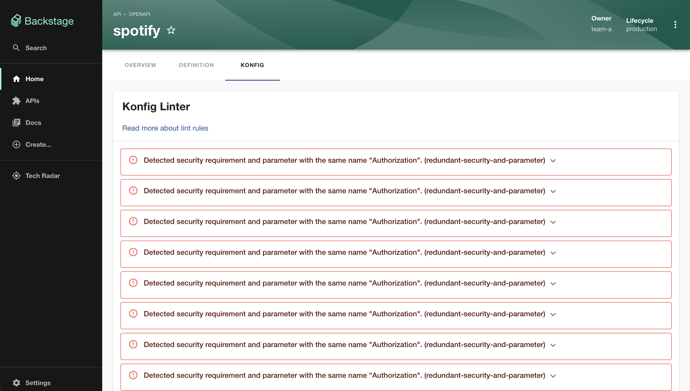

# Konfig Plugin

> :warning: **This plugin is WIP**. Today, this plugin will only lint
> your OpenAPI Specification using our
> [linter](https://konfigthis.com/docs/lint-rules) specifically built for ensuring
> high quality SDK generation. If you are interested please reach out to
> dylan@konfigthis.com or schedule a time with us
> [here](https://konfigthis.com/schedule-demo)!

Welcome to the [Konfig](https://konfigthis.com) Backstage plugin!

This plugin allows you to generate SDKs for your APIs.



## Setup

1. Install this plugin:

```bash
# From your Backstage root directory
yarn --cwd packages/app add backstage-plugin-konfig
```

### Entity Pages

1. Add the plugin as a tab to your Entity pages:

```jsx
// In packages/app/src/components/catalog/EntityPage.tsx
import { EntityApiDocsKonfigContent, isApiDocsKonfigAvailable } from 'backstage-plugin-konfig';

...

const apiPage = (
  <EntityLayout>
    {/* other tabs... */}
    <EntityLayout.Route if={isApiDocsKonfigAvailable} path="/konfig" title="Konfig">
      <EntityApiDocsKonfigContent />
    </EntityLayout.Route>
  </EntityLayout>
```
